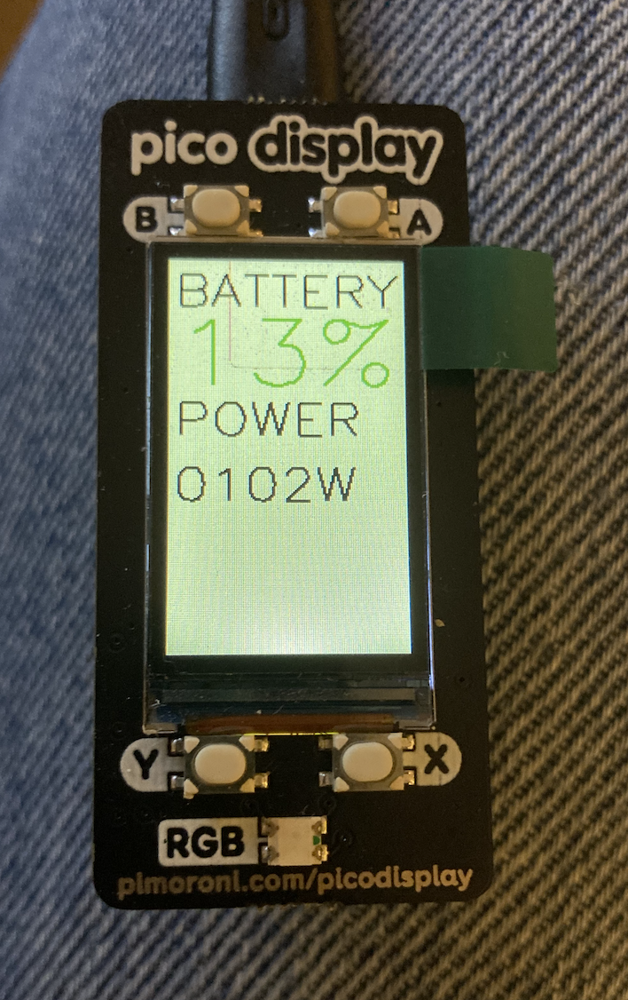

# GivNgy_PicoDisplay
Micropython script to interrogate GivEnergy API, and display battery status on Pimoroni PicoDisplay.

Requires a secrets.py file with WLAN SSID, Password, and GivEnergy invertor ID, and authorization token

